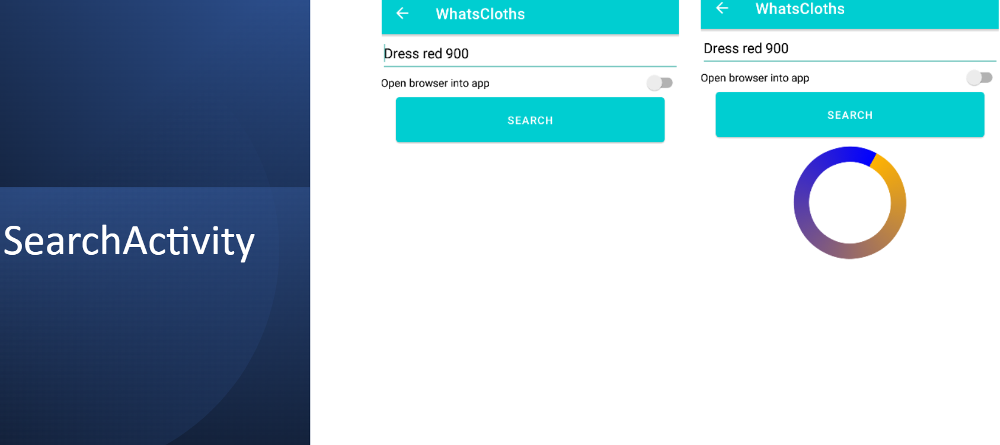

# 👚 ClassificationCloth 👚 

Questo progetto prevede la realizzazione di un’applicazione Android che, prendendo in ingresso un’immagine di un qualunque capo di abbigliamento, sia in grado di riconoscere il tipo e il colore dell’indumento in essa contenuto e conseguentemente di effettuarne una ricerca online.

Il sistema sfrutta un modello di rete neurale addestrato per poter riconoscere il capo di abbigliamento in foto ed esegue una specifica analisi per evidenziarne il colore. L’applicazione permette sia di caricare l’immagine da galleria sia di scattare una foto sul momento. I risultati della ricerca, svolta su Google, possono essere mostrati, a discrezione dell’utilizzatore, sia direttamente nell’applicazione che in una nuova finestra del browser. 

Tale caso di studio è un classico esempio di applicazione di Machine Learning e il software farà ricorso a una rete neurale convoluzionale (CNN). Tale scelta è dovuta al fatto che una rete neurale rappresenta il modo più comodo e pratico per problemi di classificazione, come quello di questa attività. 

L’applicazione, inoltre, è pensata per la piattaforma Android e quindi tale progetto pone attenzione anche all’uso di risorse in quanto dovrà funzionare su Smartphone, ovvero dispositivo embedded. 

